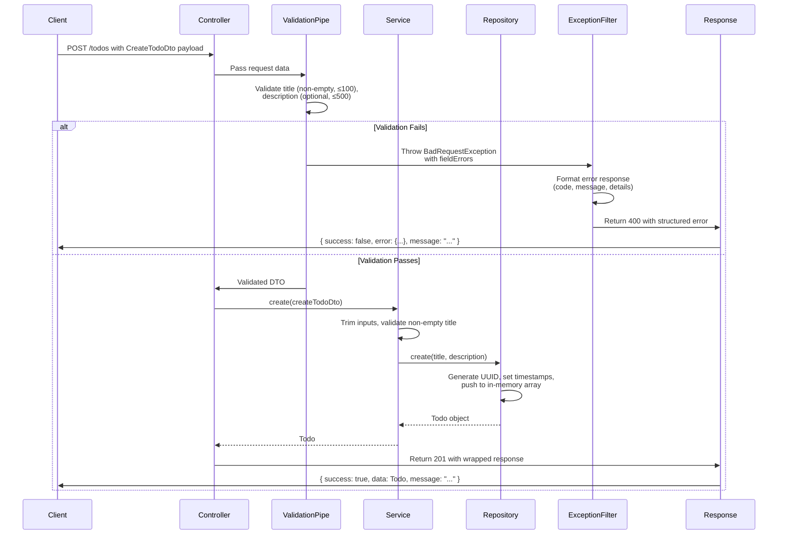
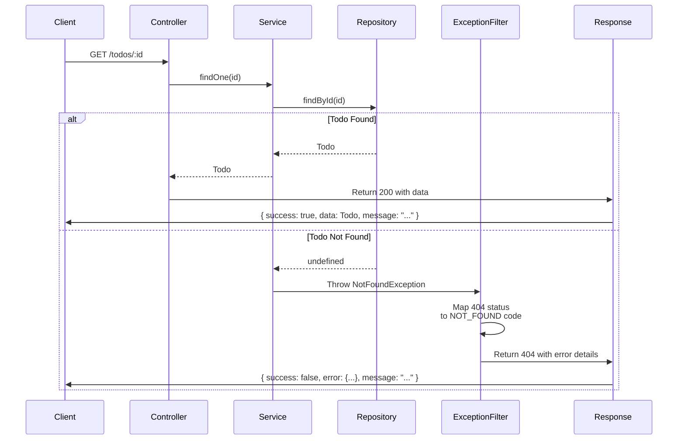

<!-- This is an auto-generated comment: summarize by coderabbit.ai -->
<!-- walkthrough_start -->

<details>
<summary>📝 Walkthrough</summary>

## Walkthrough

This PR introduces a complete NestJS TodoList API project with layered architecture (Controller → Service → Repository), global error handling via custom exception filters and validation pipes, in-memory data persistence, REST endpoints, and comprehensive documentation covering architecture and setup.

## Changes

|Cohort / File(s)|Summary|
|---|---|
|**Configuration & Build Setup** <br> `tsconfig.json`, `nest-cli.json`, `package.json`, `.gitignore`|TypeScript and NestJS project configuration with CommonJS module system, decorator support, dev dependencies (CLI, ESLint, Prettier), and standard build/runtime scripts; .gitignore excludes dist, node_modules, coverage, OS metadata, and IDE configs while preserving key project files.|
|**Core Application Bootstrap** <br> `src/main.ts`, `src/app.module.ts`|Entry point bootstraps the app with CORS, global ValidationPipe (whitelist, forbidNonWhitelisted, custom error formatting), and HttpExceptionFilter; AppModule imports TodosModule to establish module wiring.|
|**Global Error Handling** <br> `src/common/filters/http-exception.filter.ts`|Custom HttpExceptionFilter standardizes error responses to include code, message, details, timestamp, and path; maps HTTP status codes to predefined error codes and preserves nested validation details from ValidationPipe.|
|**Todo Feature Module** <br> `src/todos/todos.module.ts`, `src/todos/todos.controller.ts`, `src/todos/todos.service.ts`, `src/todos/todos.repository.ts`, `src/todos/entities/todo.entity.ts`, `src/todos/dto/...`|Complete CRUD feature with controller exposing GET/POST/PUT/PATCH/DELETE/toggle endpoints; service layer enforcing validation and error handling; repository layer managing in-memory todo storage with UUID generation; DTOs (CreateTodoDto, UpdateTodoDto) with field validators; Todo entity with id, title, description, completed, and timestamp properties.|
|**Documentation** <br> `Architecture.md`, `README.md`, `01-TodoList/00-Design/code-review/...`|Comprehensive guides covering layered architecture, module system, DI patterns, request-response flow, error handling strategies, API endpoints, development commands, and comparison with vanilla/Express approaches; code review document detailing implementation details.|

## Sequence Diagram(s)





## Estimated code review effort

🎯 3 (Moderate) | ⏱️ ~35 minutes

## Poem

> 🐰 *Whiskers twitching with pride*
> In NestJS burrows deep and divine,
> Todos hop through each layered line,
> Validations guard, exceptions align,
> From Controller to Repository's design,
> A well-nested warren of code—sublime! ✨

</details>

<!-- walkthrough_end -->


<!-- pre_merge_checks_walkthrough_start -->

<details>
<summary>🚥 Pre-merge checks | ✅ 2 | ❌ 1</summary>

<details>
<summary>❌ Failed checks (1 warning)</summary>

|     Check name     | Status     | Explanation                                                                          | Resolution                                                                         |
| :----------------: | :--------- | :----------------------------------------------------------------------------------- | :--------------------------------------------------------------------------------- |
| Docstring Coverage | ⚠️ Warning | Docstring coverage is 0.00% which is insufficient. The required threshold is 80.00%. | Write docstrings for the functions missing them to satisfy the coverage threshold. |

</details>
<details>
<summary>✅ Passed checks (2 passed)</summary>

|     Check name    | Status   | Explanation                                                                                                |
| :---------------: | :------- | :--------------------------------------------------------------------------------------------------------- |
| Description Check | ✅ Passed | Check skipped - CodeRabbit’s high-level summary is enabled.                                                |
|    Title check    | ✅ Passed | The title accurately describes the main change: implementing a NestJS version of the TodoList application. |

</details>

<sub>✏️ Tip: You can configure your own custom pre-merge checks in the settings.</sub>

</details>

<!-- pre_merge_checks_walkthrough_end -->

<!-- finishing_touch_checkbox_start -->

<details>
<summary>✨ Finishing touches</summary>

- [ ] <!-- {"checkboxId": "7962f53c-55bc-4827-bfbf-6a18da830691"} --> 📝 Docstrings were successfully generated.
<details>
<summary>🧪 Generate unit tests (beta)</summary>

- [ ] <!-- {"checkboxId": "f47ac10b-58cc-4372-a567-0e02b2c3d479", "radioGroupId": "utg-output-choice-group-unknown_comment_id"} -->   Create PR with unit tests
- [ ] <!-- {"checkboxId": "07f1e7d6-8a8e-4e23-9900-8731c2c87f58", "radioGroupId": "utg-output-choice-group-unknown_comment_id"} -->   Post copyable unit tests in a comment
- [ ] <!-- {"checkboxId": "6ba7b810-9dad-11d1-80b4-00c04fd430c8", "radioGroupId": "utg-output-choice-group-unknown_comment_id"} -->   Commit unit tests in branch `feature/#7/todolist-nest-version`

</details>

</details>

<!-- finishing_touch_checkbox_end -->

<!-- tips_start -->

---


<sub>Comment `@coderabbitai help` to get the list of available commands and usage tips.</sub>

<!-- tips_end -->

<!-- internal state start -->


<!-- DwQgtGAEAqAWCWBnSTIEMB26CuAXA9mAOYCmGJATmriQCaQDG+Ats2bgFyQAOFk+AIwBWJBrngA3EsgEBPRvlqU0AgfFwA6NPEgQAfACgjoCEYDEZyAAUASpETZWaCrKPR1AGxJcAZiWrYFN6QABRmAOwAlJAEtPgeSLiQ5IhJgCE9gCATkIA2tYAga5CQBgByjgKUXAAcBQYAqjYAMlywuLjciBwA9B1E6rDYAhpMzB2waADu+BgAbFMAnACMHQBSaBJoAMoMFPDcuAD6AELwAl4d3NgeHh1VhTWI5ZCjE9Nz89Xr+IEMJJACVBgMWC+fy4QIkDoRDqxeKJMApXBgKQURDwSbVaDOUhJP6YQFcZjaLCFda4ALtfjcMjVGwkCTwEhjSjkkIYSY/BKpOjRQr1FQkDzkvwBILVADCQWodHQnEgACYAAyyqZgRUqgCs0Hlao4aoAzBxZbMAFpGAAi0i2O3Ekw4BigNI8kvoSAcwQidsgotgogA1hykkNuF4aLRbQUoIAUseygBqBwC2q5BAKgTgA1x0JxciRAzhyCAB2bAC7jgAZFyCACq7AB7NkEAJIOAEZrU2yM1mAIJWACSkEAoV2ADkHADiDkEAieOARkGa+nM7pIIARUcAJQuAWUXABkzFerITTJDrI/hkEyOXyC9rRn0xnAUDI9HwPhwBGIZGUIYUrHYXF4/GEonEUhk8iYSioqnUWh0u5MUDgVBUEwU9CFIcgqCvIY2AwGUqDGexHAJFxfjfRRlC/TRtF0MBDD3UwDHleYwGgRR8HqRIOnleUwHNFEiAwDp3xIMAgjpBkoTI/1kmkdIskAFXnAB2WyBABrOwAH3pHeYNGYUMDAAIgUgwLEgesm3PCCnUQpwUOPRhRgwUhEB3FTaFoZA0B4hCil4pZ1kgAAJaBoCsSASAAD2+XZUSwHx4A8Gg+GoSAiJIsiKNSDprNSWyOkQCgGCYlhmEmDpfP8pkRhabgwHczzrQwDQ0oCjRcGQXBRiSMgHCCZB4SlNYEloahvMgJRST88yRV4aRKCkZ0sEoCh8D4GruEme5EA0GBvUgIrKAUDBUgobAxGQQbhsgUbxukSAxl6Wb6Q8MzIASH0fmY9AMHoNhEEQNBSAAGku+gmCu9RvLQS55EQbq0GO9aKBpH7to0NrtAFFBYPwGIZu4NBZA8fA/piaGgnarBKQoMBfP5egGvgJr8shnxhoJIneEUFapTkGGfgANU+gnmsmKwdhIKbAOQXy3J2xHbv4E8wb8+rGcJlr4AwEmKDJ8WfIlz7NukMbFp2zB6EZhjkD28r7FwZaxDBegAZ4eHEb+ta3MpMRqbfBJ2Em6bzv00hIb1ynvnMnh+gSBhXMt4arzmvgGEdfmQnKn5HOcv28paoPojVlBStdkgiEglqxolpIpceNWEgMmOSC88aNCMYzrIQ9yxooK92HUWQuAAA3srKAFEPKL/KADE/ICxvGFD5AJcgRuQtIuJwtwSKbPWWL4sS1gUqDxBMtaHKO+Lgqg5KxBG6MIoAHkilbowKJSPTMFIUNIAAal1CoOhVIxW9SeAyalC62PpSufClmUAFk6DwEcPJRSdoCJjzCpRKKuAYoaB6OIBiw1vCgLkkpSwql1KXilA4bS8hdKAkvtIIw9ZTJSgsuQBC8D3pIJFGlH4QVIET2gTPDo1DEGshFK9dGEsiAmxaJQRaKMY4eGwEoa8yUsACGwH5I8eBzilSekoSkV0yAMHpIgJ6iMiCaJiLxBQSJ7okCegfOybBSSEzQE9JsppW4dCAQQYOkxfI6KeonSxB0vAOybEkbq9wKAvkgEiFEkwwDcKGh4AWkAzryApiIMQC0XGBGZnLLxqE/ZBngOo3AHh5CsiSPAWhvCTYMB9EYjQQhECTCeqVV6LiKlVIwG4q6PFUhhISA0yYHMZrLTSRLEOYifhVx9uoXaCAaD+mKTnb4NdCSQDpusUU6F7AkBaLwrmwtzItNSGrZwzpaE7RzrQRIT1WRKD2MlWgFxpBPSYIYx6z0Tr4B0aXMuyl6zpXTuNYREdWqiEdF8oRukq4BylBtc4JwsmuVgu9YhHoihsnMJYf+mB4B+FSJAHuXgVIYE+rIAAXpQU+EsdqEIMnQLgN8AAsspH7ymfq/d+L1llfwZK5X+AcuCAOOSAhSaDwFgCMEw8iLDoqz3rPFcZT4wTSVkny9BKk1LgWwfQXByF8EnjJYZfebK4gMEcOwFJnifgSsBOoaVQRZWhBgbZMcU5pzRCFvnPhFkbXrDAAINA9x6DjxFRixsLZnBmpoAbS1kAfE8BqvbS60KAq8CQCxVICNjEnXhpQchkrzWhp+CEJZsEIleD4IAJMJIDrF6lkn4JaaRjRRI42Q0RtawEgKaJsT1LnXPsLITkzAnqmmgAfD1XqRaNRSc0o2FAhp8H0rQZ1/CAqLSmhG/poilDIHuGIbyyA0T4EMZcdAmaQ2giCEo+AQQxDDW+nrFaR6U2YzAI6WQ80tqLWOH5WFyBc2TDdpcSgT0y0BIrU9at+Ba0XsiL2/tui4YCIoEIkI/9KZeF7a2yAwHQMuAgwfcDisACO2B9E+ERpXNyaBmBBh+DnKwpjoCQE4nEXRRBEaesicbads6QgMxHflVmlInot1aO3WOkwsUBSev4uk3x720n5IXTeiBsNutmiCMEujAzOCQN8iQyAGYYD8o6Do7c/G6PXYEeuC0UQfhSboxOPg8BggyZgEJGNHRwasKMe4cpm0HBTmnUd1h3M/F1KeWAkRuk/D1Qa2CkBsATRgLISkmxti7EeUoJgkFhpQaGnSVdChxGIF09wSkydpnILnYI6zLTPg5JJZ7O6ZHsWEfwAhHwQ1mAD3pFFoIeH9EEEVjW9QF6eBMkSGolNy6xHFIcAwD2yBn0eaWtemVZcBVIpUp8qzPyZqpYBRt4F/sa5gr4BCn2sb33l2hiCg7tAzjeyhQGv5IdnAbcZCKS5aL6T9RhqgY5v9Qisly07IhZVob0VxTe+TryICCoVSi3T6KkhYpNbi3JhKKDEvPlqilt81RUqpXShl4gmUA8VuxH+f8uVAN5WAqHQriK+sntPMVHQbCt3rKaf+rdZW2nle8pVF5II4KQs4DVF9yVGQ9KQ46FlAxBG9C+qQqHWfs85zJWaG1fmKfp4kFSzZI34HibgJRqzwbFJ3eWhkWj/CweKUQJGAonrdS6zI2tNzIB4ayT6XWzgkicjaKECWOzLhPWWlgYeSgJAO6GrQbD4n5pInewwPz93DyZ1gpl/XT5db6xvW4g9FqU19oPh0fGYs0SvTyro8P/J8DcBggGJKatdGsbzlM0m1AKv0FszehzL60RBkc4ugEK6drrvylurAantiNK1vtfAEc+AtdIwyYaPpK/UAspjFEnIAQ/H765gLkA3gSzAGwZKGH/NDs8wfGw/9sNeGcLpguNVPjxVd+INoT0u71gAIq3K/dsaRImIgGRJqHfLRCtFWYPfkTSPVDvBaUkBJCWKWGWLpNbSJbhdgFAZACLOvI1SYXJJ6RtZIaGC6N7XyRPMfV5ZSVbD5AKDbXrX5bbJ7MfKJS7K8cFW7X2OucQOFKAFkbcGHVFeHTFYWHFPFVHdHUlZ2LHG+NURUfHAwF+QnTST+Wkb+dlcnSAeoJrVBHcCBOnKBCKN1DoeEdpeATpDAbnRSXnLBAXVVIXHSTVaQ8XSXT2ShSARTUUeoFsOpQpZJImehVpBEEOcwypNEIgnZK6PZewQEEgAkRWPwIIHfB2MtZOKpL4EgGwfAOfYROSOKBgOSR5MgFQNJJQYMEgA+PAU0U9SGa8bgYWCgA+OTKaBFYnTHLdEabAGFNgJ5HoBgV5Gg9bFghgrbf5ZgzdVg/bdgo7Tg07Hg8XKABFcgVbWHNFfRRHMQlHIlAwM+KQoha+G+B+J+RQxlFQllNQtlEgDlGuCnHlZgXQlbQiAw5hIw1hOGUpcpMIyw3Qmw5VOwrSdVKJdoowJsfNd2VWSyEpMpUgCwtXQKDwmeQdb1GAQwpIe7OJTPcOLiWEeESpULZtK4mrPXA3SAcxP6dfP7JfJ6YJbyI3RAS0TeNxPAWAYacA74FWGPBk5OEIaRWRJ6ZA6gMTUkGuIJdTTARRE6LObDZRQ8NRDRa1GeBQIIM4R0XAZA25QeMAPWRzZAygYvUWagVkzaNySpJ6bAEA7DdxWkc0FRJQAEeUkITw7wjoTYb0GWBgXRaAeLEgRLK0FGGEAuROVudYM+KeKwNGHgvge4UEbgfE1I5ABFcRMgHocgYRPQAAXnmAqA0HlBzJaJBxf2+DaOcP3R+HGyUFoAAG4vsh5PYgh+s61fhsjSptTuBEk/DAVoUSjileSjpeFg8ujH8iBwCYUDIx04SyZxAC5dINdFS0BCsfYUkBjBi6DhjoZGCxjAUt0Tw2DDsvZIUuCYV5jztlidiiTMcDiqUjj6UTjlCoJzjScNDOVIBuVgF7j5VHjhUGdjD8iOh5zuBpJEN2ZSorC0Ffj+dNI1VhcgTnCQSwSrkPZaZNpmyVJCsEMrkGsNpXU5yFysklyTIpdSSgKHthoVDB4YYgo35q5k5flfVEB0LrknpeJuzEAEAC5fl21sU9ptgC4c5fl/z8z4CC0mR+AjsssCYRLnBwtCTyB1Ykh+LCsTppMPAwtULuAGLsVY9zIyoZp/zFyiZ2AUJU8khE57o05U5JQuZlNXsgLkA6QLIqKA5JplsoBRRyK/oKym42CB4vVkB6w0KgL+5h5G5fyBLOLgLd5JDkALzKV5hZgFClC34zjxFWUydnzXyqd+UacnjQoXip4fz55oIl5e4Mpmg15cpO5vJCoSqKAd5QKFVME/jIKHCRdgSDBQS3YEKITGNBAFYo4XIKrN5PEAo4T0AESxV0BcKKCWpyogpIimoKBjlCU1oJ0No5sdpesyZAQdcWwfpRAE8rNVL3D+NuBBNKrhMarGBqBYjkATqzrGS/lthAkLJ5q9l4BCVx1J0Ac21pA7oHlE4a98oFYnU4Dn1joiCXqr1s16A4YEYkZ+oBljkC4psZsmLVqKAak35mKyNxzoNYBF0kgCQ/d+qvdQRor0JgdI06AZKpRjZmJjNsBCsnK/ZtSN0C4bo/rDlWsgjab0as9FsaotFnkVrJ1KbXoqkkNHk/Feodp3JEhJtSQyaAch4sBfl1qCbIZEaNqJhI1JBJRHh+RN8uAsRW50alklAQgdkya0bJ0gZlZ7gE4WkTb0bAFbojEQgAY7btpLSWkYsdp1r7BRh6j2LoZyzpL2ovBPqNokC28iYxg5d0A1g/ISj2YXKESEJjsoU2Cm5Ht+Y7qN5u4aqgqsAQrCqkpirPkV4yrspBr8pqrPkd495Fi2VM7fZzEWTVVCkwd7MQhG1h5fldyXpB5IgwwRxG4KDAQPaC7vIuB86hMmlHgQMZQJVgC69EB7Il6R6gl8ACYm707da1gaBSTVkO77Au7hQdo+7VaZpB6fLbpR6oBG541D6fhnbJ1zaSBLbFaYsuAMBShf1XJ0avaVYuBMB60uAlpeE94swn6nr9a37hpXbOaPagGlZtpQGMBwGs8oG3kMEhiJiRjpLHstzJjqK9zW65iNFjJJdaapiP5B4m457zqMARNKBi6R5fyirGJl5V4a7p6ult5Sp+4QgqKvA16R57rC7PlG4MxhwoArBZjQcL7R6YHvLc7bq25+GWHLrRG4jo1JHvJWGKBoGRwFGDzj7ypFAVGx6J7YAp757Z7NH56noWTUguAV7ItSoN7Ugt6JAd7aATH5G4Gj7vQPBN9Qh1GU5YNPpdF8kMlQVo9rHH7n74HVlTb370Iv6yRf7/6MbAHba0GQHLosHIGDITGYGUmj6EGKAkH3bPbCn7gMGSm9YcGzyMdpCDj5h5g8djjEqidVDHyrjNCMr3zqd9Dcq/V8rWFfyCQJY6qfiME+cNIrwoLHDRdtV2r4KqY3C2VFNZmBp81Ykd6otLb559md5ohZrsRmylp5ydKGEpqjVG1bRXLr87JiiTg6APQABxJjBWTjJmbjNmXafaeO81f0fk4aNQWgJYgAdSlX9DoBqX+EQHVMeWlxiwIDa1rsMbQHPRQiuYnPb1FK4xagBhVt60ht2UWveqlAOD+hpG61SAMfCP2gsjpnrG8NNHrGgCbCPj2FbhsBsGv2JytIjqlBxiOnSYy1LigF+d6siRJpxbRCDlCCYc3iMeiBzi6Pe15q+vWucqgH/SRC9xrkZv4CwCoxsBozIDpCGgwDr1FO2BTtEsgF1GonlEILZaCUoAEBAxNUWSbEDRFJ2TNbbO0QoqSH9D8t1xT2OeThsyoDYAmAoE9xjteVaIodvu4O+nPvB1LKIp+w+1dY8roGXPeXwe+UIYex2xYL2zIaPBmPMe4KofhQuzocbf3JOxzbPoYgvq1nTXWalH7oQGwLRR8FeV2Oio6cpQqEWF6dOPvJSouLSpuJfMp1GayvGa11eKZ1/OhBXloAICYglBoC1LIlBgIHmZ50WdsOarwRgqBzgs6u2bGvcNNApOgBRcSMgAPkfASRCELy1Y2i2BBGKQPamlcLGtbtyXiauzvuQHFBBBIF9VNF6yINwB1opkxnmNtA9HEByWCFKb4UABQCXDGRIIWgakg0q8L1YgjAHKMjXAWQIUnivhZj3jUktANyQ/aiC+Kga2ZEWVv5ekpLfKAAfggZaYLjI8Bo+g8Go643ITXWk/Y+9LbW48gDkPlH47xYCmcoMABdL1DyHnqz0dgilBi2KXUcRBo42lS1IscXMlwqlF6z9Z1klbMkEvbsUA6N+Cs5SGQG0ShSkvQDISrJrObX7SwJTlUU7zWpICZaSA8RLyNSuTY5RjiEYFPaqrTorjg9riPIbhHjUfIqQ8lFQ4IHYdHmeMmcZ1gVnn3bIkPePdA8lHPbiEvfwEbo9HDJr0oGY7C88pHgI68Ck7Y/7iIIc/S2RBHgAAEmxEAEVcBW4mPZBG4npG4FvEASQJvNu5uUU3J6hkzyoQh5hqJIg96+ucP5BS3r5G5V0uTvJJPsGymQWdZpvDTZutvFumigaPANv5vFvduoH9vDvjuDJTvtPLuoqh2Dj3WErF2P4Hz1Chn0qN2HjsqvzRUGu54EoD2Ogj38AOhGbCYWJoQuvr3rDb2mqVmWrH2xdn2o9X2KE2VC8EPIAahuAyfKvoZtXufmoQ76Nai3VVLImHAmaa4ZA58m0rAagaNE4rAeXRR7JotOb3um1yoggfg5PJgFZPPyRRuc1iONOePzv5RpSLQxOWov62PTetOLvxzAxyj6AeTsj78MB8TW48Wm1POYvMB8lNIiCbPUvHESKZvyRfvN5PprEdvVOOhFuDh3f/AF7E5weTvNeLtJZhoiyOOGEWkvBIem1xbtSs5rNEYC4IirYE98mNoOajEHY4Afh2ePm0k4Ya54AFZSfLKNeSXAW44QO7ZYIwAJfMkpRLFlyoAaHr43LfKR4ueeeyI0P8Bqumv6NCfj3u+z2Keieeup/wuuAzHu2piolG4F+Kul+qu/s2V6EG19psOBuNEH6RvPASAXviPJv9pG4o//vAfv+4+9uI8dPkXzO4XdAmI8R7tb0mDv9VOn/HWP/z+7yc/+wPWAZt2AFEAoeYAuRiPGd6rI6AL3P1vEBT5wCm0CA6PgD026J9k+mAPeI8SnZw9KUuoNUIjzvLI9l2gza4gAgx4fksetXb8tM3ngE8W20gOjN1xzZU8wKNPCCnTwfYEJYKEucLm+xbqzEc2XASJr6lqJr8QM9iI8holEEaBxBpUDWkoF8jnxfkJMS4E1mKQUMH+HfS+vtDz7kgCYoQYjthiN4uDVOlvUTlaBt6uC/8ZnK8G7yIGYBsMbXEMPWCSC29eE2GLfnQAiEeC2O+JUElrU9gl9s8WFabJVQLhWBvcnfDwMAF9R6B0WC5WQMUlGT2Vf2/7LCLdC7rhxR2DuXIZ9FCxp1AEljdWAf3o4kAPQrQ0+ko27yxDr4rIZYlAAZjOtPmisXFGwEGGIpXK7lDoY3F9Sr9BBzXHQQRz0EU9DBu8Xvr8kRYw0hoOHeUqZWsCNCPASJZHotChqOIViQhdYqIXrDI4CU2xegTFVvg0oWBSVJdj8FSpPk12IzTHtu1RL1cYoWgleBB3CTxBC0EghqksxVQAloKcgp9gYCg6s8rIipOinmm/SFoUAZnOvOBxmi2Y90LOdYDRnuzVQfAeLCjBtA0HmpmADsQzP6zWhXRjKyALoh+FowHtth+IiEVYKfxVZVYLSMoKMDpAZYXm1gajOyOa5qDT2EJDQQFz4TlcaAvPIJJ33mQ0dvIPGHNGCwmTa4bMULAmHCwRYjZo8UBI9EIipZRFFqisYGCrF74o1fqSidfOOXr6kBqyCoN4FbRizCdvmrcGjKIPJBoxtg0mcyHujorKiLIpg2gB8g8AhBsMaMQIEIjtG3RCe6+RKF0RMotILIzon4ISzWCBiZAQ6I8BjCjQ74okNIxAK6L44ejDWkAb0b6IJ4cACYXAAMfSGepn0DI2KDQRUIjEHxyAIjY0YrFNFroVoM2ZMaSA6BZiKxOnKscJzl51iVhDY6+ASNg6xDPYnYlUef0VGX9oYHGNUSzDZiO16AcY2DCyIF5XhfUk40mp6N67K9VefojoAuLvAnDlxp4mUWRDDGc8XxSoncaSz3GUgDxA4+MSeLJ4+oyIF46cR6FsT1AfRrcCUevwfF/Jyiq4t8RUKCDJQpAfY/8UeKERlE8BIEuIGBO/rVile0AFXrBO0ELjOIRARjMEAIBUS0kuAomFbR+AVDaJ1EjCY8iwlATNI54uUJWMImvIox0KWgMyPMwjZYIsHMYFQDbIGte+AAb0QiZD76TZYIQvUsRcBfUP1N2qQHG7FIAAvqEEThMA0xYyQdnpTwqfN8STfIShCKfT8h5SaIOisawrSPJC8H6BUShy3FPQNxHkuIMv3/FmSdoofDOGzBnw6xIGCSLUXZIihSxoWm0a5AZ2oINVK2QiatkwRIb1sEmrrLNroN4L71b66jJuOiP/w2TjGtRQIqXXx4rCwRxUn9LVSEahA8aGvEdj8D2ZAV8SR/O7Lrg8rvRJg1Zf7H0PsztFhEctV+AXGzY5SEpyKG4Rig2L3DxCTw88jO1vhZl4qC7VgcynYGo9OBtxN8v8OhzY9d2uPEEX6MAoYUIq9VcCss0FyyCnCiIjqsz0QoojxqDXQth2kCIHSpme7ZYevwg7hUd4U0c0KYNfH0YNKPwOUZAAO5AUvWGXc1kVLBK1Snojk8tN8HHJ0U0MA2FwFNHpGxYkZAGIsiVkWiOAhqNMGXvNHCoOw+u2WHaC2lYj+BaAsScSh+C2RGwpi5NSWB2T8xqI7mFwQXnwnBEIyVkeMlNInHrIgYMZ8gIIKqU3QIA/cV9MaiiHbE/A/py2CtquQIbrlRixDXbDuQ7ZZSVBE04yLP35h3cvKJ/dQc11BnVcPpQIxrt9O0G/SgKPXQQnDluHYo5pWxNHG0z2LkoDisoedjeT6bJUvhK7H4VwLuJ7TacEzfgV9Mqk/TmuGgUWehlkBQjLpsI1Zq1XkH3TwSOzBCKfgvSDpSkUoNGUXDFmNlImw8Y6RB0Tniyd42I8jLiMDJ9ZS5g2aDPOlGoaDhBFMxmTtFFA2AagpoR5HgDfSDd+uW5UURGKjEximxqyQCegD3Qciqk8HGmGELiEFIsAj3Q8KbkWqUBhOEYg4LICbC0AMJ08wcWNQ0EbRWRNNWgMJxXnhxX+dJJ7pMC3oryc5KJLLkQVp5SgagNQGxEbnJEXBkuVvHwWiAADkICzGjdFJBkY4C5wVijtFGS9Zj8eclCKkGQTCdYhfYs0i+PkygMXOyAdvuIC77YLQgRvB+VAIXoMSuQwiECCNKnJ8IeJK46LC+MjG4BqynEphcBLfnQwL5qiIGc6BPBxMSYrI4TjhJoDHzFYaE4GdDBpjOCRZM848UnCeg8KTBJKfhcQWzifArownViV4HEU6KNqM0ShaqkVo68TwFkHiewoGFcLXWl8vhSgAEU5EhFWij0CHCtxTzXITHeUr8iQVxFBsqCy1C4s0W4B3F7CggKSEiR/1mAZQPgLpDorCc7gO0RTKCQNwutE4HcortWU/nIAbEdlFUeaQJgSAqU1ZfZujE9iVMyyDHZBbdwnTwwokEHIwB1K4In9UJhIe5lwsQDoyy55FDDqMW8FlBroJ9Xzo8kFGrBUQfAeOlSDLEFtBFmi13rYtUXNDcGa2NWVWw1lENa2ExDKfBw4LNsDZHoI2eZHmGlc5+xchsheiWGxz7Z8c6uXWj37WBgmFGQ6O0OG6wM9aR9A9upLIgABtAALqQB0ykAX5XvR6GKAhuWORuBPMuDuLfUQK7oYMueXgq95B8o+Y2Ne5EAt6GggAD7RZeFqi4FfCrBX3db5RvHSWORE6PzLCaK/5ZADAUYqyI+KtoYSqbgYLUVJvDhZZUP4nDgArMUpAULIhPQQFRvEBZAGxUgLIBwCjAMKtFVGKQFegPQHSqy7Yr5lslBlafRNkQD+QeAvsaSvRWfLFVOKlRSqrhWMr1VjcfRdqrRUKroYSq3FUaqgAgqEVRK+/BQHcV+Nd6xqtVfMKMmwR3FkS6JbQOUirFhCs0h4RIS9nTt9isVXUKtIDlI8NpwcjgcM24FjN9pfAnHsCLtmgj454mCtCnKkFXT7CN0oduLizldVX5uMiTBUuem2pCWXMtoDzJoDIBfUtM1UtTAC6/VeiIXFpB4jxYzYFAw0JGvhQjQykro4+M+c106WDZE4IKWLBQx87HRNqmAIxNYs7l4coAkK6MVat+WQAyOzYoMXPMiQciUJJcpObvIli0Aexn9VlZ4L1XQwyOfgXADdXHVZcZFEXLXk1gTJz4u4syllqHhPDMAXQvCG+dKJCArzeeXAdybzytU7q++ZPHSkFHcGoAhhjHXYCxxiDbBaRkMBRHARflKCEIa4iyDcovTFLal76hCPS1oCMt8MzLLRqNQlgl4sNeAdBS+ItVsrYh4Gj8Yv18kEBoNu6xLhR1Vh7oDeJC++eSvIX+DyMIYSINWVD47RkNcRVDTEFf7VkWmmGiWNhurKMLj1ZylwCptgBDQxgn63AN+tZG/r7F6itXMIo9DQZJ616u3uys3Hcb8AXAbyVBtvUwaAp+Ck4Q5sOTgpu5neJ5eWNg099ENJ4CmFTLfUYaVaGmnzbksI0nrxZemgzUZpM1XQzNaKCzU4uvkehUJZuVjTeusVkdRFUi98URt00wxktHhL9T+to0ZaZlVmqAOars3RD3NZHfReTQCEtQqxpWhLXWiS0fqqtxmmrfPXM31bnFihPmmxjKFD5BkKW4bcw1GoAaahBcKZYnAo1UbeIZmnOPRtFiMbIhCmwbqQtJKAbeKgW2orOMskzQc1RZP2tgSLiykAQ8gCWAbgH58A1avWqdS0nZLakEgy1YLflBtobQptZK9xBSW1KLQBSRMcOBhoA3I1VO8mX4FcVKw4SiAvMzbMHJ03JyVZeDFZSlLWU1txi3yLZdMS7ZZ09lswufqaorUVp2G5UyudmuRkRVwBjS8zJcOGg51xobOl1eUsVh/R8C8gA9pOpcC3qOlH2lwDDyzAs7517QYcDAw3XQrvlPy8pmPW7G9jmtBkK1crsfq3ywNW4iDdKLc1cKtdI8FldfDY2fi9dnGi/k5s12y6x6NmuxuruHI+aONrmrcbboKAwNct6Ep3R7s92P0mtZugrYsOuEuyZpdw0NQtPaaRrlp4QWlGtI+FsCE1W0pNeHJ4EAi8qNsqEPSWcSFILCF0/NWnPp4IjGeSI0yOWu9K+lkstSXPUQFhK9ZfCwBEULRUr1ck6iDRUarOQmoYkxAU0AANIkBvoqyOhSrS1prqXyxFRAF2hoDMA1B5dDAJUg9CrdRkaUjbHIskUSJ7YS+3FOMM+5OdQgcRdQOaDSxfdWh5JUkExUtiUAsasET6Mfsc4ZYMwU/SwQhCn2wRvQ4gX2CYLQAAK65TlD0BiAoBYhIAwZBUH7NtGFklZdzD0JUVaB4BWop6J8Bei4DHJUgHoelh5jqCNBIAwnZIahMNSRJeyUuAvscD0i+gx2d0T5rQA9Ag8EklyIji0zEAlBLgXocg6cnwBNh6sWSdQPcLQ3hTcARwK6KKE+geB/KQYNDVLG+B5ot8NAWCMIYVlEBQSiOIoEvlib4Au4Ih99dgCICwB5D0gUEusG1iAgPQ0gUGR1UoA14uyVBj0MkOHzBjIk6RV/MahZGqIoy88AAFTuGOg7hooh5DsPEFzk5MlLIkDcCjt/ekJRvf4TjiiFbcSIIcu3qllogRlwovJo1OfyiIAdwymREdH4DyJ4DfFGaF6QSxt6e9mgbHcssvDqykKq+utjrIbZ6zdlaw3Ka0Vvo7Lu2RXAnSQxexKzFAurbLc7LWLh63Zkez2c8KWk3xZQPTWNetOJzfC0ea7bQmMH+F4R/wQkqJD/rPCfzmUN4WCE2PGBwiUIy89CJ+DUBYRfwuEAwKsegjqA9gBMRAHsFSp0A9gobJILuEuP7hXItAeYAwHmCyho1cVb4+EF1BUoGANKWYBUCmB0AKgFQK4jMG6Y/GqUPgeUAwAEDyh6Abxq40lBuN3GHjK7J44eBwiGBVj3UC5JQFIB7BYipSe4y8cJNGBZJw4OSEgFsAHBEYhc2gEsh2O4ArAS9OgHJF8AxNjEDJ1ip8COgsn8ApSWwHydmgCmHoDJpAAfCRDbAyEGAKU+SIFCCmCgckY5JRq6KmhxTIPAyIgFYOlIpTV6DU5AC1MEwbAXRdwIR2NM+hTTy0c05aZ1MYA6IFK+06qZlMMn84Z0WgIt1dAACpTCkWU5qdDi4B7TQMABYgClNfK7d9Jz3Z7rkiUmfQKhtgMGfdPkLPQ3oE06GcTMWmqxjp/DHmcTNyRhkS6/KMGftP2AfQOwSkOic9DoQbAKgU44AEwCZAAgB0NSYpADh+nqgFb5ls5IJZpM/QeDNjAH8vCIc3bs1PDRCk8sDwPabTMkBgz4qzeGgkTO6ThzCZ/M8mZzOpml8wZ209ihTNTn8zBZwiUWfNOlnyzYObyIeZmjuDe1/hfkPIHFVlA2l+zIdlwF0YNyXU1auyDSW3QnhaKqJSapkmmpdJTzO50c1wDkjjnrcBkKC6WbPS16wQXp9U8OZnPbAUyn0RcwedgtG91znuzc/GenMWmUzS5jM+KeI6Nn7ky5zC+ebJDoX7gDFss5bBcwpIqLHpVTgYmUAuxUAuZaiAAFIxkWSJtEBEJm/xuD7AVSk7kQP0Ate0gFkjkdQAVBBL8oISxoCQtJn0jQ8yYMGdhbbAj6sBeHZ3vxFdEN03yJbQodphtZesd0cQKiwF2GKzcVAF2IpeFNHQtLrFmCxafgtDltLWFuc8jjwvpnYLJltjjGbt26ThwPyvM3JHDO2BMzEq4M38b9lommBCwJgSQD+N+ABA4QNS2qFoAgnZQFQXUKVYECGg0A8wJqPKFmCzABA3wMq1SlmB0BdQPgKlKZG+BTABAxVnwN8apRQWErXqLk9a1f6pXWrSoFq+EB8BTBwgVKOYBUAEDdM0A4QbqwwFlCyhKraANUHIXCBTAfjPgPUAwFmA0oGAPgcILMF1A7XNrAgPUJddoANWfA9V2YENYiu8IlkdF8w9Ew8AkhJQUp7c5qetkFUEo5zUqADbItyQwln0LuBZbHxSn5grF2zACDHywtegep7i5FalP0oNzw4GKzFfeMQAqapJoAyQApN7n7jBJ/QEAA -->

<!-- internal state end -->

**Actionable comments posted: 3**

<details>
<summary>🤖 Fix all issues with AI agents</summary>

```
In `@01-TodoList/NestJS/src/main.ts`:
- Around line 32-46: The current exceptionFactory in main.ts only reads
error.constraints and misses nested validation errors; update the
exceptionFactory to recursively traverse each ValidationError's children to
collect constraints and build dotted field paths (e.g., "profile.firstName"),
flattening all messages into the messages array used for the
BadRequestException; specifically modify the anonymous exceptionFactory function
that processes the errors parameter so it walks children recursively, merges
constraints from nested nodes, and produces the same output shape (field,
errors) used in the returned BadRequestException.

In `@01-TodoList/NestJS/src/todos/todos.controller.ts`:
- Around line 99-123: The PUT controller's contract (JSDoc) promises
required-fields validation but UpdateTodoDto has all fields optional, so
update(`@Param` id, `@Body` updateTodoDto) via todosService.update() allows partial
updates; either enforce required fields for full replace or change docs. Fix by
choosing one: (A) enforce title presence for PUT by adding validation in the
controller/service (e.g., in update method validate that UpdateTodoDto.title is
defined and throw BadRequestException) or (B) change JSDoc to state PUT supports
partial updates and remove “필수 필드 누락 시 400” — reference the update method,
UpdateTodoDto, and todosService.update to locate the code to modify.

In `@01-TodoList/NestJS/src/todos/todos.repository.ts`:
- Around line 27-32: findAll() currently calls Array.prototype.sort on
this.todos which mutates the repository's internal array; change it to sort a
shallow copy instead (e.g. create a copy via spread or slice and then sort) so
the internal this.todos order is preserved, keeping the same descending
createdAt comparator logic in the findAll method.
```

</details>

<details>
<summary>🧹 Nitpick comments (12)</summary><blockquote>

<details>
<summary>01-TodoList/NestJS/src/todos/entities/todo.entity.ts (1)</summary><blockquote>

`8-41`: **Consider adding default values or making `description` optional to match DTO.**

The `description` property is typed as a required `string`, but `CreateTodoDto` marks it as optional (`description?: string`). When a Todo is created without a description, this property could be `undefined` at runtime, causing a type mismatch.

Additionally, the constructor with `Object.assign(this, partial)` doesn't initialize default values, so unset properties will be `undefined` rather than their declared types.


<details>
<summary>♻️ Proposed fix to ensure type safety</summary>

```diff
 export class Todo {
   id: string;
   title: string;
-  description: string;
+  description?: string;
   completed: boolean;
   createdAt: string;
   updatedAt: string;

   constructor(partial: Partial<Todo>) {
+    this.description = '';
+    this.completed = false;
     Object.assign(this, partial);
   }
 }
```

</details>

</blockquote></details>
<details>
<summary>01-TodoList/NestJS/src/todos/dto/create-todo.dto.ts (1)</summary><blockquote>

`16-19`: **Consider adding whitespace trimming to prevent whitespace-only titles.**

`@IsNotEmpty()` does not trim whitespace, so a title like `"   "` (only spaces) would pass validation. Consider adding `@Transform` from `class-transformer` to trim the input, or use a custom validator.


<details>
<summary>♻️ Proposed fix to trim whitespace</summary>

```diff
+import { Transform } from 'class-transformer';
 import { IsNotEmpty, IsString, MaxLength, IsOptional } from 'class-validator';

 export class CreateTodoDto {
+  `@Transform`(({ value }) => typeof value === 'string' ? value.trim() : value)
   `@IsNotEmpty`({ message: 'Title is required' })
   `@IsString`({ message: 'Title must be a string' })
   `@MaxLength`(100, { message: 'Title must be 100 characters or less' })
   title: string;
```

</details>

</blockquote></details>
<details>
<summary>01-TodoList/NestJS/src/todos/dto/update-todo.dto.ts (1)</summary><blockquote>

`10-35`: **Consider semantic difference between PUT and PATCH operations.**

The DTO is used for both PUT and PATCH endpoints, but all fields are optional. For strict REST semantics, PUT should replace the entire resource, requiring `title` to be mandatory (as it is for creation). Currently, a PUT request with an empty body would succeed but leave the todo unchanged.

If this is intentional for flexibility, consider at least documenting this behavior or adding service-layer validation for PUT to ensure required fields are present.

</blockquote></details>
<details>
<summary>01-TodoList/NestJS/src/todos/todos.controller.ts (1)</summary><blockquote>

`87-97`: **Consider validating UUID format for the `id` parameter.**

The `id` parameter is passed directly to the service without format validation. If the system uses UUID v4 (as indicated in the entity comments), malformed IDs will propagate to the repository layer before being rejected.


<details>
<summary>♻️ Proposed fix using ParseUUIDPipe</summary>

```diff
 import {
   Controller,
   Get,
   Post,
   Put,
   Patch,
   Delete,
   Body,
   Param,
   HttpCode,
   HttpStatus,
   ValidationPipe,
+  ParseUUIDPipe,
 } from '@nestjs/common';

 // Then update each endpoint with id parameter:
 `@Get`(':id')
 `@HttpCode`(HttpStatus.OK)
-findOne(`@Param`('id') id: string) {
+findOne(`@Param`('id', ParseUUIDPipe) id: string) {
```

Apply similar changes to `update`, `patch`, `remove`, and `toggle` methods.

</details>

</blockquote></details>
<details>
<summary>01-TodoList/NestJS/src/common/filters/http-exception.filter.ts (2)</summary><blockquote>

`28-29`: **Consider catching all exceptions, not just `HttpException`.**

The filter only catches `HttpException`. Unexpected runtime errors (e.g., `TypeError`, uncaught promise rejections) will bypass this filter and return NestJS's default error format, breaking the consistent error response structure.


<details>
<summary>♻️ Proposed fix to catch all exceptions</summary>

```diff
-import {
-  ExceptionFilter,
-  Catch,
-  ArgumentsHost,
-  HttpException,
-  HttpStatus,
-} from '@nestjs/common';
+import {
+  ExceptionFilter,
+  Catch,
+  ArgumentsHost,
+  HttpException,
+  HttpStatus,
+  Logger,
+} from '@nestjs/common';
 import { Request, Response } from 'express';

-@Catch(HttpException)
+@Catch()
 export class HttpExceptionFilter implements ExceptionFilter {
-  catch(exception: HttpException, host: ArgumentsHost) {
+  private readonly logger = new Logger(HttpExceptionFilter.name);
+
+  catch(exception: unknown, host: ArgumentsHost) {
     const ctx = host.switchToHttp();
     const response = ctx.getResponse<Response>();
     const request = ctx.getRequest<Request>();
-    const status = exception.getStatus();
-    const exceptionResponse = exception.getResponse();
+    
+    const isHttpException = exception instanceof HttpException;
+    const status = isHttpException
+      ? exception.getStatus()
+      : HttpStatus.INTERNAL_SERVER_ERROR;
+    const exceptionResponse = isHttpException
+      ? exception.getResponse()
+      : { message: 'Internal server error' };
```

</details>

---

`64-65`: **Use NestJS `Logger` instead of `console.error` for production readiness.**

`console.error` doesn't integrate with NestJS's logging infrastructure. Using the built-in `Logger` service enables log levels, structured output, and easier integration with external logging systems.


<details>
<summary>♻️ Proposed fix using Logger</summary>

```diff
+import { Logger } from '@nestjs/common';

 export class HttpExceptionFilter implements ExceptionFilter {
+  private readonly logger = new Logger(HttpExceptionFilter.name);

   catch(exception: HttpException, host: ArgumentsHost) {
     // ... existing code ...

-    console.error(`[${errorCode}] ${errorMessage} - ${request.method} ${request.url}`);
+    this.logger.error(`[${errorCode}] ${errorMessage} - ${request.method} ${request.url}`);
```

</details>

</blockquote></details>
<details>
<summary>01-TodoList/NestJS/.gitignore (1)</summary><blockquote>

`37-42`: **Broad `*.json` pattern may unintentionally ignore config files.**

The `*.json` exclusion with specific whitelists could ignore other config files you may add later (e.g., `tsconfig.build.json`, `jest.config.json`, `.prettierrc.json`). Consider being more specific about what JSON files to ignore.


<details>
<summary>♻️ Alternative: ignore only data directory JSON files</summary>

```diff
 # Data
 /data
-*.json
-!package.json
-!tsconfig.json
-!nest-cli.json
+/data/*.json
```
</details>

</blockquote></details>
<details>
<summary>01-TodoList/NestJS/package.json (1)</summary><blockquote>

`8-16`: **Consider adding test scripts for future phases.**

The README mentions Phase 4 will include unit and E2E tests. You may want to add placeholder test scripts now to prepare for that.


<details>
<summary>♻️ Optional: Add test script placeholders</summary>

```diff
   "scripts": {
     "build": "nest build",
     "format": "prettier --write \"src/**/*.ts\"",
     "start": "nest start",
     "start:dev": "nest start --watch",
     "start:debug": "nest start --debug --watch",
     "start:prod": "node dist/main",
-    "lint": "eslint \"{src,apps,libs,test}/**/*.ts\" --fix"
+    "lint": "eslint \"{src,apps,libs,test}/**/*.ts\" --fix",
+    "test": "echo \"Error: no test specified\" && exit 1"
   },
```
</details>

</blockquote></details>
<details>
<summary>01-TodoList/NestJS/README.md (3)</summary><blockquote>

`84-94`: **Add language specifier to fenced code block.**

Per markdownlint, fenced code blocks should have a language specified. For ASCII art/text output, use `text` or `plaintext`.


<details>
<summary>♻️ Proposed fix</summary>

```diff
-```
+```text
 ╔════════════════════════════════════════════════════════════╗
```
</details>

---

`183-207`: **Add language specifier to directory structure code block.**

Per markdownlint, use `text` or `plaintext` for directory tree representations.


<details>
<summary>♻️ Proposed fix</summary>

```diff
-```
+```text
 NestJS/
 ├── package.json              # 의존성 및 스크립트
```
</details>

---

`215-217`: **Add language specifier to architecture diagram code block.**

Per markdownlint, use `text` for text-based diagrams.


<details>
<summary>♻️ Proposed fix</summary>

```diff
-```
+```text
 Controller (HTTP) → Service (Business Logic) → Repository (Data Access)
```
</details>

</blockquote></details>
<details>
<summary>01-TodoList/NestJS/src/main.ts (1)</summary><blockquote>

`22-24`: **Use environment variables to configure CORS origins instead of the default permissive mode.**

The current setup accepts all origins by default. For production, restrict to an allowlist via environment variable using NestJS's origin callback pattern for proper validation.

<details>
<summary>Proposed change</summary>

```diff
-  app.enableCors();
+  const allowedOrigins = (process.env.CORS_ORIGINS ?? '')
+    .split(',')
+    .map((origin) => origin.trim())
+    .filter(Boolean);
+
+  app.enableCors({
+    origin: (origin, callback) => {
+      if (!origin || allowedOrigins.includes(origin)) {
+        callback(null, true);
+      } else {
+        callback(new Error('Not allowed by CORS'));
+      }
+    },
+    credentials: true,
+  });
```

Add to `.env`:
```
CORS_ORIGINS=http://localhost:3000,https://app.example.com
```
</details>

</blockquote></details>

</blockquote></details>

<!-- This is an auto-generated comment by CodeRabbit for review status -->

---

01-TodoList/NestJS/src/main.ts
```diff
+      exceptionFactory: (errors) => {
+        // 검증 에러 메시지 포맷팅
+        const messages = errors.map((error) => ({
+          field: error.property,
+          errors: Object.values(error.constraints || {}),
+        }));
+
+        return new BadRequestException({
+          success: false,
+          error: {
+            code: 'VALIDATION_ERROR',
+            message: messages[0]?.errors[0] || 'Validation failed',
+            details: messages,
+          },
+        });
```

_⚠️ Potential issue_ | _🟡 Minor_

<details>
<summary>🧩 Analysis chain</summary>

🌐 Web query:

`class-validator ValidationError children constraints nested DTO NestJS`

💡 Result:

In `class-validator`, a `ValidationError` is shaped like:

- `constraints`: failed validations **on that exact property**
- `children`: nested `ValidationError[]` for **nested objects / array elements** under that property ([github.com](https://github.com/typestack/class-validator?utm_source=openai))

So with a nested DTO, it’s normal to see something like:

- error for property `"profile"` has **no** `constraints` (because `profile` itself might be “present” and valid as an object),
- but it has `children` containing errors for `"firstName"`, `"age"`, etc.

### Make nested DTO validation actually run (NestJS)
For nested DTOs, you generally need **both**:

```ts
import { Type } from 'class-transformer';
import { ValidateNested, IsString } from 'class-validator';

class ChildDto {
  `@IsString`()
  name: string;
}

class ParentDto {
  `@ValidateNested`()
  `@Type`(() => ChildDto) // important so the child becomes a class instance
  child: ChildDto;
}
```

Without `@Type(() => ChildDto)`, the nested value may remain a plain object, and nested decorators may not execute as expected ([stackoverflow.com](https://stackoverflow.com/questions/58343262/class-validator-validate-array-of-objects?utm_source=openai))

For arrays:

```ts
class ParentDto {
  `@ValidateNested`({ each: true })
  `@Type`(() => ChildDto)
  children: ChildDto[];
}
```

(Using `each: true` is the common pattern for arrays.) ([stackoverflow.com](https://stackoverflow.com/questions/79635429/how-to-validate-nested-array-of-object-by-groups-in-nestjs-with-class-validator?utm_source=openai))

And ensure transformation is enabled in Nest’s `ValidationPipe`, otherwise incoming JSON won’t be turned into DTO instances:

```ts
app.useGlobalPipes(new ValidationPipe({ transform: true }));
```

### Getting a “flat” error list (optional)
If you want messages like `child.name must be a string` instead of nested `children`, you need to recursively walk `children` and collect `constraints` ([dev.to](https://dev.to/ahurein/mastering-data-validation-in-nestjs-a-complete-guide-with-class-validator-and-class-transformer-40fj?utm_source=openai)).

Citations:

- 1: https://github.com/typestack/class-validator?utm_source=openai
- 2: https://stackoverflow.com/questions/58343262/class-validator-validate-array-of-objects?utm_source=openai
- 3: https://stackoverflow.com/questions/79635429/how-to-validate-nested-array-of-object-by-groups-in-nestjs-with-class-validator?utm_source=openai
- 4: https://dev.to/ahurein/mastering-data-validation-in-nestjs-a-complete-guide-with-class-validator-and-class-transformer-40fj?utm_source=openai

---


</details>

**Handle nested DTO validation errors by traversing the `children` array.**

In class-validator, nested validation errors appear in the `children` array rather than `constraints`. The current code only extracts from `constraints`, so nested objects with validation failures will have empty error arrays. Use a recursive approach to flatten both direct constraints and nested children, building proper field paths like `"profile.firstName"` for the error details.

<details>
<summary>Proposed change</summary>

```diff
-      exceptionFactory: (errors) => {
-        // 검증 에러 메시지 포맷팅
-        const messages = errors.map((error) => ({
-          field: error.property,
-          errors: Object.values(error.constraints || {}),
-        }));
-
-        return new BadRequestException({
-          success: false,
-          error: {
-            code: 'VALIDATION_ERROR',
-            message: messages[0]?.errors[0] || 'Validation failed',
-            details: messages,
-          },
-        });
-      },
+      exceptionFactory: (errors) => {
+        const flatten = (errs, parent = '') =>
+          errs.flatMap((error) => {
+            const path = parent ? `${parent}.${error.property}` : error.property;
+            const own = Object.values(error.constraints || {}).map((msg) => ({
+              field: path,
+              errors: [msg],
+            }));
+            const children = error.children?.length ? flatten(error.children, path) : [];
+            return [...own, ...children];
+          });
+
+        const messages = flatten(errors);
+
+        return new BadRequestException({
+          success: false,
+          error: {
+            code: 'VALIDATION_ERROR',
+            message: messages[0]?.errors?.[0] || 'Validation failed',
+            details: messages,
+          },
+        });
+      },
```
</details>

<!-- suggestion_start -->

<details>
<summary>📝 Committable suggestion</summary>

> ‼️ **IMPORTANT**
> Carefully review the code before committing. Ensure that it accurately replaces the highlighted code, contains no missing lines, and has no issues with indentation. Thoroughly test & benchmark the code to ensure it meets the requirements.

```suggestion
      exceptionFactory: (errors) => {
        const flatten = (errs, parent = '') =>
          errs.flatMap((error) => {
            const path = parent ? `${parent}.${error.property}` : error.property;
            const own = Object.values(error.constraints || {}).map((msg) => ({
              field: path,
              errors: [msg],
            }));
            const children = error.children?.length ? flatten(error.children, path) : [];
            return [...own, ...children];
          });

        const messages = flatten(errors);

        return new BadRequestException({
          success: false,
          error: {
            code: 'VALIDATION_ERROR',
            message: messages[0]?.errors?.[0] || 'Validation failed',
            details: messages,
          },
        });
      },
```

</details>

<!-- suggestion_end -->

<details>
<summary>🤖 Prompt for AI Agents</summary>

```
In `@01-TodoList/NestJS/src/main.ts` around lines 32 - 46, The current
exceptionFactory in main.ts only reads error.constraints and misses nested
validation errors; update the exceptionFactory to recursively traverse each
ValidationError's children to collect constraints and build dotted field paths
(e.g., "profile.firstName"), flattening all messages into the messages array
used for the BadRequestException; specifically modify the anonymous
exceptionFactory function that processes the errors parameter so it walks
children recursively, merges constraints from nested nodes, and produces the
same output shape (field, errors) used in the returned BadRequestException.
```

</details>

<!-- fingerprinting:phantom:poseidon:eagle -->

<!-- This is an auto-generated comment by CodeRabbit -->

---

01-TodoList/NestJS/src/todos/todos.controller.ts
```diff
+  /**
+   * PUT /todos/:id
+   * Todo를 전체 수정합니다 (모든 필드 필수).
+   *
+   * @param id - Todo ID
+   * @param updateTodoDto - 수정할 Todo 정보 (모든 필드)
+   * @returns 200 OK - 수정된 Todo
+   * @throws 404 Not Found - Todo를 찾을 수 없는 경우
+   * @throws 400 Bad Request - 필수 필드 누락 시
+   */
+  @Put(':id')
+  @HttpCode(HttpStatus.OK)
+  update(
+    @Param('id') id: string,
+    @Body(new ValidationPipe({ whitelist: true, forbidNonWhitelisted: true }))
+    updateTodoDto: UpdateTodoDto,
+  ) {
+    const todo = this.todosService.update(id, updateTodoDto);
+
+    return {
+      success: true,
+      data: todo,
+      message: 'Todo updated successfully',
+    };
+  }
```

_⚠️ Potential issue_ | _🟡 Minor_

**PUT endpoint allows partial updates due to all-optional DTO fields.**

The JSDoc states "@throws 400 Bad Request - 필수 필드 누락 시" (missing required fields), but `UpdateTodoDto` has all fields marked as `@IsOptional()`. This means the endpoint won't throw 400 for missing fields, contradicting the documented behavior.

Consider adding service-layer validation for PUT to ensure `title` is provided, or update the documentation to reflect the actual behavior.

<details>
<summary>🤖 Prompt for AI Agents</summary>

```
In `@01-TodoList/NestJS/src/todos/todos.controller.ts` around lines 99 - 123, The
PUT controller's contract (JSDoc) promises required-fields validation but
UpdateTodoDto has all fields optional, so update(`@Param` id, `@Body` updateTodoDto)
via todosService.update() allows partial updates; either enforce required fields
for full replace or change docs. Fix by choosing one: (A) enforce title presence
for PUT by adding validation in the controller/service (e.g., in update method
validate that UpdateTodoDto.title is defined and throw BadRequestException) or
(B) change JSDoc to state PUT supports partial updates and remove “필수 필드 누락 시
400” — reference the update method, UpdateTodoDto, and todosService.update to
locate the code to modify.
```

</details>

<!-- fingerprinting:phantom:poseidon:ocelot -->

<!-- This is an auto-generated comment by CodeRabbit -->

---

01-TodoList/NestJS/src/todos/todos.repository.ts
```diff
+  findAll(): Todo[] {
+    // createdAt 기준 최신순 정렬
+    return this.todos.sort((a, b) => {
+      return new Date(b.createdAt).getTime() - new Date(a.createdAt).getTime();
+    });
+  }
```

_⚠️ Potential issue_ | _🟠 Major_

**`findAll()` mutates the internal array via `sort()`.**

`Array.prototype.sort()` sorts in place, so each call reorders `this.todos`. This can cause subtle bugs if other code expects insertion order, and it performs unnecessary work on repeated calls.


<details>
<summary>🐛 Proposed fix: return a sorted copy</summary>

```diff
  findAll(): Todo[] {
    // createdAt 기준 최신순 정렬
-   return this.todos.sort((a, b) => {
+   return [...this.todos].sort((a, b) => {
      return new Date(b.createdAt).getTime() - new Date(a.createdAt).getTime();
    });
  }
```
</details>

<!-- suggestion_start -->

<details>
<summary>📝 Committable suggestion</summary>

> ‼️ **IMPORTANT**
> Carefully review the code before committing. Ensure that it accurately replaces the highlighted code, contains no missing lines, and has no issues with indentation. Thoroughly test & benchmark the code to ensure it meets the requirements.

```suggestion
  findAll(): Todo[] {
    // createdAt 기준 최신순 정렬
    return [...this.todos].sort((a, b) => {
      return new Date(b.createdAt).getTime() - new Date(a.createdAt).getTime();
    });
  }
```

</details>

<!-- suggestion_end -->

<details>
<summary>🤖 Prompt for AI Agents</summary>

```
In `@01-TodoList/NestJS/src/todos/todos.repository.ts` around lines 27 - 32,
findAll() currently calls Array.prototype.sort on this.todos which mutates the
repository's internal array; change it to sort a shallow copy instead (e.g.
create a copy via spread or slice and then sort) so the internal this.todos
order is preserved, keeping the same descending createdAt comparator logic in
the findAll method.
```

</details>

<!-- fingerprinting:phantom:poseidon:ocelot -->

<!-- This is an auto-generated comment by CodeRabbit -->

